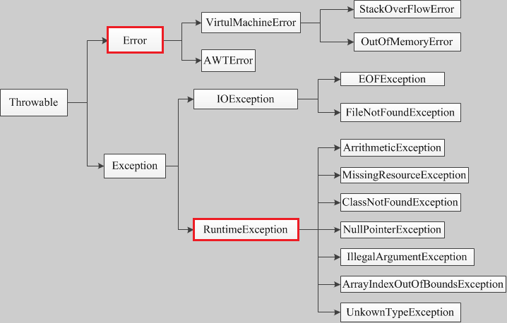

## 1 如何跳出嵌套循环？
```java
    public class Test {
        @Test
        public void testBreak() {
            go:
            for (int i = 0; i < 100; i++) {
                System.out.println(i);
                for (int j = 0; j < 100; j++) {
                    System.out.println(i + ":" + j);
                    if (j == 22) {
                        break go;
                    }
                }
            }
            System.out.println("go");
        }
    }
```
## 2 值传递和引用传递
> 值传递：指在调用函数时将实际参数复制一份传递到函数中，这样在函数中如果对参数进行修改，将不会影响到实际参数。    
> 引用传递：是指在调用函数时将实际参数的地址直接传递到函数中(的形参)，那么在函数中对参数所进行的修改，将影响到实际参数。      
> Java 中的基本类型，属于值传递。        
> Java 中的引用类型，属于引用传递。           
> Java 中的 String 及包装类，属于特殊群体，作为形参时，由于每次赋值都相当于重新创建了对象，因此看起来像值传递，但是其特性已经破坏了，值传递、引用传递的定义。因此他们属于引用传递的定义，却表现为值传递。

## 3 Java中的异常


> Error：是程序中无法处理的错误，表示运行应用程序中出现了严重的错误。此类错误发生时，JVM将终止线程。非代码性错误。因此，当此类错误发生时，应用不应该去处理此类错误。     
> Exception：程序本身可以捕获并且可以处理的异常。  
> **非检查异常（unckecked exception）**：Error 和 RuntimeException 以及他们的子类。javac在编译时，不会提示和发现这样的异常，不要求在程序处理这些异常。所以如果愿意，我们可以编写代码处理（使用try...catch...finally）这样的异常，也可以不处理。
> 对于这些异常，我们应该修正代码，而不是去通过异常处理器处理 。这样的异常发生的原因多半是代码写的有问题。      
> **检查异常（checked exception）**：除了Error 和 RuntimeException的其它异常。javac强制要求程序员为这样的异常做预备处理工作（使用try...catch...finally或者throws）。在方法中要么用try-catch语句捕获它并处理，要么用throws子句声明抛出它，否则编译不会通过。这样的异常一般是由程序的运行环境导致的。
> 因为程序可能被运行在各种未知的环境下，而程序员无法干预用户如何使用他编写的程序，于是程序员就应该为这样的异常时刻准备着。如SQLException , IOException,ClassNotFoundException 等。