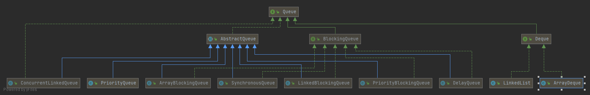

# Java Collection(集合框架)
## 1 概述
> 用于动态存放对象的容器   
> 解决数组不能满足的需求：
> * 长度可变
> * 不同类型
> > *注意：集合只能存放引用，但类型可以不同，而数组是可以存放基本数据类型和引用，但是类型必须统一*  

Collection 集合主要接口、类


Map 主要接口、类


## 2 Collection    
> 其实Collection并不是集合的顶层接口，而Iterable才是
### 2.1 Iterable接口
> 字面意思就是可迭代的，核心方法是  
> Iterator<T> iterator();   //获取迭代器，而迭代器则是为了方便迭代操作  
> 另外1.8之后还实现了两个默认方法用于Stream()
> > Iterator接口核心方法：hasNext()、next()、remove()
### 2.2 Collection接口
> Collection 接口继承了Iterable, 三个子接口如图     
>    
> 包括以下自有方法：

|return|method|description|
|----|----|----|
|boolean|add(E e)|添加一个元素并确保成功返回true|
|boolean|addAll(Collection<? extends E> c)|添加指定集合中的所有元素|
|void|clear()|删除集合中所有元素|
|boolean|contains(Object o)|判断集合是否包含此元素|
|boolean|containsAll(Collection<?> c)|判断集合是否包含指定集合的所有元素|
|boolean|equals(Object o)|判断集合是否相等|
|int|hashCode()|返回此集合的hash code|
|boolean|isEmpty()|判断集合是否包含元素|
|boolean|remove(Object o)|删除集合中此元素（如果存在）|
|boolean|removeAll(Collection<?> c)|删除指定集合中包含的所有此集合的元素|
|default boolean|removeIf(Predicate<? super E> filter)|删除满足过滤条件的元素|
|boolean|retainAll(Collection<?> c)|保留指定集合中包含的此集合元素|
|int|size()|返回集合的元素数量|
|default Spliterator<E>|spliterator()|创建一个集合的分割器|
|default Stream<E>|stream()|创建一个通过上面方法创建的分割器的流|
|default Stream<E>|parallelStream()|创建一个可并行的分割器流|
|Object[]|toArray()|转换为对象数组|
|\<T\> T[]|toArray(T[] a)|转换为指定类型的对象数组|

*以上仅做简单描述，详细描述可见源码*
### 2.3 List接口
> List 接口继承了Collection，包括以下自有方法：

|return|method|description|
|----|----|----|
|void|add(int index, E element)|添加一个指定位置的元素,0<=index<=size|
|E|set(int index, E element)|替换一个指定位置的元素,返回之前的元素|
|boolean|addAll(int index, Collection<? extends E> c)|添加到指定位置的集合中的所有元素,0<=index<=size|
|E|get(int index)|获取指定位置的元素|
|int|indexOf(Object o)|包含此元素则返回第一个该元素的位置，否则为-1|
|int|lastIndexOf(Object o)|包含此元素则返回倒数第一个该元素的位置，否则为-1|
|ListIterator<E>|listIterator()|返回列表迭代器，ListIterator继承了Iterator|
|ListIterator<E>|listIterator(int index)|返回从指定位置开始的列表迭代器|
|E|remove(int index)|删除指定位置的元素|
|default void|replaceAll(UnaryOperator<E> operator)|将元素替换为满足指定操作符操作的结果|
|default void|sort(Comparator<? super E> c)|将元素按照指定比较规则进行排序|
|List\<E\>|subList(int fromIndex, int toIndex)|返回指定位置段的元素|

*以上仅做简单描述，详细描述可见源码*
> List的常用的实现为ArrayList、Vector、LinkedList    
> 
### 2.3.1 ArrayList
> 底层原理是数组，查询快，增删慢，线程不安全     
``` java
    /**
     * Default initial capacity. 默认初始化数组长度
     */
    private static final int DEFAULT_CAPACITY = 10;
```
> 核心方法，扩容   
``` java 

    /**
     * Increases the capacity to ensure that it can hold at least the
     * number of elements specified by the minimum capacity argument.
     *
     * @param minCapacity the desired minimum capacity
     */
    private void grow(int minCapacity) {
        // overflow-conscious code
        int oldCapacity = elementData.length;
        //这里相当于默认扩容1.5倍
        int newCapacity = oldCapacity + (oldCapacity >> 1);
        if (newCapacity - minCapacity < 0)
            newCapacity = minCapacity;
        if (newCapacity - MAX_ARRAY_SIZE > 0)
            newCapacity = hugeCapacity(minCapacity);
        // minCapacity is usually close to size, so this is a win:
        elementData = Arrays.copyOf(elementData, newCapacity);
    }
```
### 2.3.2 Vector
> * 通过方法声明添加synchronized来实现线程安全，其他跟ArrayList没太大区别
> * 初始容量也为10，扩容默认为2倍而ArrayList是1.5倍
> * 增加了一些自己的方法，包括addElement()、elementAt()、removeElement()等
> * Stack 栈继承了Vector

### 2.3.3 LinkedList
> 底层实现原理是链表, 因此增删快，查询慢     
``` java
    private static class Node<E> {
        E item;
        Node<E> next;
        Node<E> prev;

        Node(Node<E> prev, E element, Node<E> next) {
            this.item = element;
            this.next = next;
            this.prev = prev;
        }
    }
    
    //查询的方法，离头部近则从头部顺序查找，离尾部近则从尾部倒序查找
    
    /**
     * Returns the (non-null) Node at the specified element index.
     */
    Node<E> node(int index) {
        // assert isElementIndex(index);

        if (index < (size >> 1)) {
            Node<E> x = first;
            for (int i = 0; i < index; i++)
                x = x.next;
            return x;
        } else {
            Node<E> x = last;
            for (int i = size - 1; i > index; i--)
                x = x.prev;
            return x;
        }
    }
```
> 同时也实现了Queue接口，可以当队列使用，但是线程不安全

### 2.4 Set 接口
> Set 继承了Collection，没有自己独有的方法，与Collection一样 
> 常用的实现类为HashSet、TreeSet、LinkedHashSet、EnumSet  
> EnumSet用于存储枚举对象元素，其它的实现原理都是直接用对应的Map, 因此可详见Map部分

### 2.5 Queue 接口
> Queue 继承了Collection, 独有的方法包括：

|return|method|description|
|----|----|----|
|boolean|offer(E e)|添加一个元素到队列尾部|
|E|element()|获取队列头部的元素，但不删除该元素，如果队列为空则抛出异常|
|E|peek()|获取队列头部的元素，但不删除该元素，如果队列为空则返回null|
|E|poll()|获取队列头部的元素，且删除该元素，如果队列为空则返回null|
|E|remove()|获取队列头部的元素，且删除该元素，如果队列为空则抛出异常|

*以上仅做简单描述，详细描述可见源码*

> 主要的几个接口和实现类 



### 2.5.1 非阻塞队列 
1. LinkedList
2. PriorityQueue
3. ConcurrentLinkedQueue
### 2.5.2 阻塞队列


