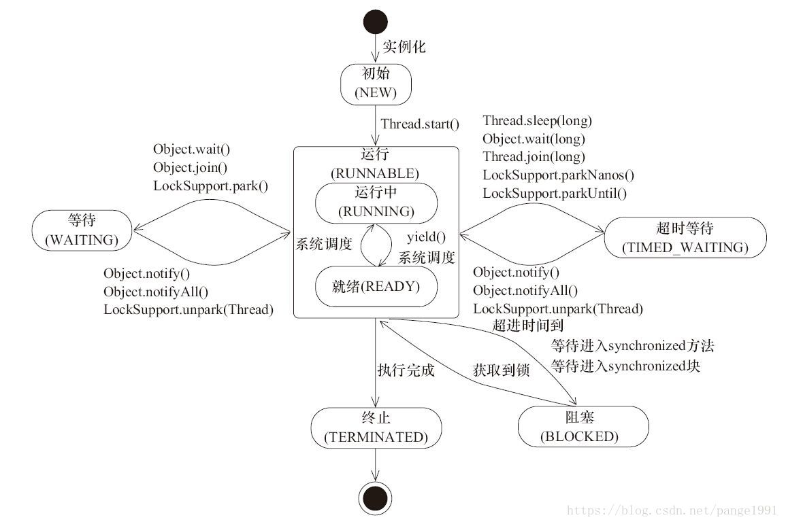

#Java 并发 - 知识体系

##Java 并发 - 理论基础
1. 多线程的出现是要解决什么问题的? 
   - 提高资源利用率，充分利用CPU空闲时间片
   - 分解任务，提高工作效率
   - 统一进程的多线程，共享内存等资源，使得不同任务之间的协调操作和运行、
   数据交互、资源交配等问题更易于解决
2. 线程不安全是指什么？举例说明
   - 线程安全：多个线程访问同一个对象时，如果不用考虑这些线程在运行时环境下的调度和交替执行，也不需要进行额外的同步，
     或者在调用方进行任何其他操作，调用这个对象的行为都可以获得正确的结果，那么这个对象就是线程安全的。
   - 线程不安全：多线程访问同一数据时，不提供任何数据访问保护，可能导致多个线程在更改或获取数据时造成脏数据问题。
   - 例如：
   ```java
   public class ThreadSafe {
      private static int count = 0;
      private static void increase() {
         for(int i = 0; i < 100; i++) {
            System.out.println(Thread.currentThread().getName() + "-" + count++);
         }
      }
      public static void main(String[] args) throws InterruptedException {
         Thread thread1 = new Thread(ThreadSafe::increase);
         Thread thread2 = new Thread(ThreadSafe::increase);
         Thread thread3 = new Thread(ThreadSafe::increase);
         thread1.start();
         thread2.start();
         thread3.start();
   
         while (thread1.isAlive() || thread2.isAlive() || thread3.isAlive()) {
             Thread.sleep(1000);
         }
         System.out.println(count);
      }
   }
   ```
   最终获取的count有可能小于300
   
3. 并发出现线程不安全的本质什么？可见性，原子性和有序性。
   - 本质问题在于线程之间的信息不同步
   > 1. 原子性。
   >> 提供互斥访问，同一时刻只能有一个线程来对其进行操作
   >> - CAS, 如：AtomicInteger、AtomicReference
   >> - 锁, 如：synchronized(JVM)、Lock(CPU指令，依赖代码)
   > 2. 可见性
   >> 一个线程对主内存的修改可以及时的被其他线程观察到
   >> - synchronized
   >> - volatile, 通过加入内存屏障和禁止重排序优化来实现可见性
   > 3. 有序性
   >> Java内存模型中，允许编译器和处理器对指令进行重排序，但重排序过程不会影响到单线程程序的执行，  
   >> 却会影响到多线程并发执行的正确性。
   >> 
   >> volatile、syncronized、Lock都可保证有序性。
   >>
   >> 一系列操作如果无法保证happens-before原则，就说这段操作无法保证有序性。
   >> - 程序次序规则：一个线程内，按照代码顺序，书写在前面的操作先行发生于书写在后面的操作。
   >> - 锁定规则：一个unLock操作先行发生于后面对同一个锁的Lock()操作。
   >> - volatile变量规则：对一个变量的写操作先行发生于后面对这个变量的读操作。
   >> - 传递规则：如果操作A先行发生与操作B,而操作B先行发生于操作C，则操作A先行发生于操作C。
   >> - 线程启动规则：Thread对象的start()方法先行发生于此线程的每一个动作。
   >> - 线程终端规则：对线程interrupt()方法的调用先行发生与被中断线程的代码检测到中断事件的发生（只有执行了interrupt()方法才可以检测到中断事件的发生）。
   >> - 线程终结规则：线程中所有操作都先行发生于线程的终止检测，我们可以通过Thread.join()方法结束，Thread.isAlive()的返回值手段检测到线程已经终止执行。
   >> - 对象终结规则：一个对象的初始化完成先行发生于他的finalize()方法的开始。
   
4. Java是怎么解决并发问题的？3个关键字，JMM和8个Happens-Before
   > 3个关键字：final、synchronized、volatile
   > 
   > [JMM(Java Memory Model)](./jvm.md)
   > 
   > 见问题3
5. 线程安全是不是非真即假？不是
   > 可以将共享数据按照安全程度的强弱顺序分成以下五类:
   >   
   > 不可变、绝对线程安全、相对线程安全、线程兼容和线程对立。
   > 1. 不可变
   > 
   >     不可变(Immutable)的对象一定是线程安全的，不需要再采取任何的线程安全保障措施。
   >  只要一个不可变的对象被正确地构建出来，永远也不会看到它在多个线程之中处于不一致的状态。
   >  多线程环境下，应当尽量使对象成为不可变，来满足线程安全。
   >     - final
   >     - String
   >     - Number部分子类，如 Long 和 Double 等数值包装类型，BigInteger 和 BigDecimal 等大数据类型
   > 2. 绝对线程安全
   > 
   >     不管运行时环境如何，调用者都不需要任何额外的同步措施
   > 3. 相对线程安全
   > 
   >     相对线程安全需要保证对这个对象单独的操作是线程安全的，在调用的时候不需要做额外的保障措施。 
   > 但是对于一些特定顺序的连续调用，就可能需要在调用端使用额外的同同步步手段来保证调用的正确性
   > 4. 线程兼容
   > 
   >     线程兼容是指对象本身并不是线程安全的，但是可以通过在调用端正确地使用同步手段来保证对象在并发环境中可以安全地使用
   > 5. 线程对立
   > 
   >     线程对立是指无论调用端是否采取了同步措施，都无法在多线程环境中并发使用的代码。
   > 由于 Java 语言天生就具备多线程特性，线程对立这种排斥多线程的代码是很少出现的，而且通常都是有害的，应当尽量避免。
6. 线程安全有哪些实现思路？
   > 1. 阻塞同步（互斥同步）
   > 
   >     悲观并发策略
   >     - synchronized 对于同一线程是可重入的，线程执行完之前会阻塞其他线程，性能较低，适合并发量不大的情况
   >     - ReentrantLock
   >        - 等待可中断，持有锁的线程长时间不释放，等待线程可执行其他操作
   >        - 可实现公平锁，根据等待锁时间顺序依次获取锁，而synchronized是非公平锁
   >        - 可指定解锁条件，绑定多个Condition
   > 2. 非阻塞同步
   >
   >     乐观并发策略， 操作和冲突检测放在一个指令集里
   >- 测试并设置(Test And Set)
   >     - 获取并增加(Fetch And Increment)
   >     - 交换(Swap)
   >     - **比较并交换(Compare And Swap)**
   >     - 加载链接/条件存储(Load Linked/Store Conditional)
   >> CAS需要三个参数（V,A,B）,其中V是内存地址，A是旧值，B是新值，
   > > 当且仅当V符合A时，才将B更新到V,这是一个原子操作。
   > > 如 AtomicInteger的自增操作
   ```java
   public class FutureTest {
      private static final AtomicInteger count = new AtomicInteger(0);
      @SuppressWarnings("rawtypes")
      public static void main(String[] args) throws InterruptedException {
         ExecutorService executorService = Executors.newFixedThreadPool(100);
         List<Future<String>> futures = new ArrayList<>();
         for(int i = 0; i < 100; i++) {
            futures.add(executorService.submit(() -> {
               for(int j = 0; j < 100; j++) {
                  count.addAndGet(1);
               }
               return Thread.currentThread().getName() + "-" + count.get();
            }));
         }
         executorService.shutdown();
         boolean done = false;
         while (!done) {
         Thread.sleep(10);
         for (Future future : futures) {
            if (!future.isDone()) {
               done = false;
               break;
            } else {
               System.out.println(future.get());
            }
            done = true;
            }
         }
         System.out.println(count.get());
      }
   }
   ```
   > 3. 无同步方案
   >  - 可重入代码。如果不涉及共享数据就不需要做同步，结果可预测的
   >  - 线程本地存储。如果一段代码中所需要的数据必须于其他代码共享，那就看看这些共享数据的代码是否能保证在同一个线程中执行？
   >  如果能保证，我们就可以把共享数据的可见范围限制在同一个线程之内，这样，无需同步也能保证线程之间不出现数据争用问题
   >> ThreadLocal
   >> 
   >> 每个访问ThreadLocal变量的线程都会在本地工作内存中创建一个副本，所有操作都只对当前线程有影响，而不会同步到主内存。
   > > 注意每个线程中使用完之后需要remove,否则可能发生内存泄漏
   ```java
   @SuppressWarnings({"rawtypes", "unchecked"})
   public class ThreadLocalTest {
    public static ThreadLocal local = new ThreadLocal();

    public static void main(String[] args)  {
        new Thread(()->{
            local.set(1);
            System.out.println(Thread.currentThread().getName() + "-" + local.get());
        }).start();

        new Thread(()->{
            try {
                Thread.sleep(1000);
            } catch (InterruptedException e) {
                e.printStackTrace();
            }
            System.out.println(Thread.currentThread().getName() + "-" +  local.get());
            local.set("a");
            System.out.println(Thread.currentThread().getName() + "-" +  local.get());
            local.remove();
        }).start();
    }
   }
   ```
7. 如何理解并发和并行的区别？
   > 并发：不同代码块交替执行，逻辑同时，同时是假象
   > 
   > 并行：不同代码块同时执行，物理同时
   
##Java 并发 - 线程基础
1. 线程有哪几种状态？分别说明从一种状态到另一种状态转变有哪些方式？
   
   - NEW 初始状态
   - RUNNABLE 运行，包括ready和running
   - BLOCKED   阻塞
   - WAITING   等待
   - TIME_WAITING 超时等待
   - TERMINATED   终止
   ```java
   public class ThreadState {
    private static final Object lock = new Object();

    public static void main(String[] args) throws InterruptedException {
        Thread thread = new Thread(()->{
            System.out.println(Thread.currentThread().getName() + "-2-" + Thread.currentThread().getState());
            synchronized (ThreadSafe.class) {
                System.out.println(Thread.currentThread().getName() + "-4-" + Thread.currentThread().getState());
            }
            while (true) {
                synchronized (lock) {
                    try {
                        lock.wait();
                        Thread.sleep(3000);
                        System.out.println(Thread.currentThread().getName() + "-7-" + Thread.currentThread().getState());
                        break;
                    } catch (InterruptedException e) {
                        e.printStackTrace();
                    }
                }
            }
        });
        System.out.println(thread.getName() + "-1-" + thread.getState());
        thread.start();
        synchronized (ThreadSafe.class) {
            Thread.sleep(1000);
            System.out.println(thread.getName() + "-3-" + thread.getState());
        }
        Thread.sleep(1000);
        System.out.println(thread.getName() + "-5-" + thread.getState());
        synchronized (lock) {
            lock.notify();
        }
        Thread.sleep(100);
        System.out.println(thread.getName() + "-6-" + thread.getState());
        Thread.sleep(4000);
        System.out.println(thread.getName() + "-8-" + thread.getState());
    }
   }
   ```
2. 通常线程有哪几种实现方式？
   - 继承Thread
     ```java
      public class MyThread extends Thread{
         @Override
         public void run() {
            System.out.println("我是继承Thread的线程");
         }
      }
      ```
   - 实现Runable接口
     ```java
      public class MyRunnable implements Runnable{
         @Override
         public void run() {
            System.out.println("我是实现Runnable接口的线程");
         }
      }
      ```
   - 实现Callable接口
      ```java
      public class MyCallable implements Callable<String> {
         @Override
         public String call() throws Exception {
            return "我是实现Callable接口的线程";
         }
      }
      ```
   >**分别创建线程**
     ```java
      public class ThreadTest {
         public static void main(String[] args) throws ExecutionException, InterruptedException {
            MyThread myThread = new MyThread();
            MyRunnable myRunnable = new MyRunnable();
            Callable<String> myCallable = new MyCallable();
            FutureTask<String> task = new FutureTask<>(myCallable);
            myThread.start();
            new Thread(myRunnable).start();
            new Thread(task).start();
            System.out.println(task.get());
         }
      }
      ```
3. 基础线程机制有哪些？
4. 线程的中断方式有哪些？
5. 线程的互斥同步方式有哪些？如何比较和选择？
6. 线程之间有哪些协作方式？
## 并发关键字：volatile，final，synchronized
### 关键字: synchronized详解
1. Synchronized可以作用在哪里？分别通过对象锁和类锁进行举例。
2. Synchronized本质上是通过什么保证线程安全的？分三个方面回答：加锁和释放锁的原理，可重入原理，保证可见性原理。
3. Synchronized由什么样的缺陷？Java Lock是怎么弥补这些缺陷的。
4. Synchronized和Lock的对比，和选择？
5. Synchronized在使用时有何注意事项？
6. Synchronized修饰的方法在抛出异常时,会释放锁吗？
7. 多个线程等待同一个snchronized锁的时候，JVM如何选择下一个获取锁的线程？
8. Synchronized使得同时只有一个线程可以执行，性能比较差，有什么提升的方法？
9. 我想更加灵活地控制锁的释放和获取(现在释放锁和获取锁的时机都被规定死了)，怎么办？
10. 什么是锁的升级和降级？什么是JVM里的偏斜锁、轻量级锁、重量级锁？
11. 不同的JDK中对Synchronized有何优化？
### 关键字: volatile详解
volatile关键字的作用是什么？
volatile能保证原子性吗？
之前32位机器上共享的long和double变量的为什么要用volatile？现在64位机器上是否也要设置呢？
i++为什么不能保证原子性？
volatile是如何实现可见性的？内存屏障。
volatile是如何实现有序性的？happens-before等
说下volatile的应用场景？
### 关键字: final详解
所有的final修饰的字段都是编译期常量吗？
如何理解private所修饰的方法是隐式的final？
说说final类型的类如何拓展？比如String是final类型，我们想写个MyString复用所有String中方法，同时增加一个新的toMyString()的方法，应该如何做？
final方法可以被重载吗？可以
父类的final方法能不能够被子类重写？不可以
说说final域重排序规则？
说说final的原理？
使用 final 的限制条件和局限性？
看本文最后的一个思考题
#J.U.C框架
#Lock框架和Tools类
###类结构总览

####接口: Condition

Condition为接口类型，它将 Object 监视器方法(wait、notify 和 notifyAll)分解成截然不同的对象，以便通过将这些对象与任意 Lock 实现组合使用，为每个对象提供多个等待 set (wait-set)。其中，Lock 替代了 synchronized 方法和语句的使用，Condition 替代了 Object 监视器方法的使用。可以通过await(),signal()来休眠/唤醒线程。

在JUC锁: AbstractQueuedSynchonizer详解中类的内部类-conditionobject类有具体分析。

接口: Lock

Lock为接口类型，Lock实现提供了比使用synchronized方法和语句可获得的更广泛的锁定操作。此实现允许更灵活的结构，可以具有差别很大的属性，可以支持多个相关的Condition对象。

接口: ReadWriteLock

ReadWriteLock为接口类型， 维护了一对相关的锁，一个用于只读操作，另一个用于写入操作。只要没有 writer，读取锁可以由多个 reader 线程同时保持。写入锁是独占的。

抽象类: AbstractOwnableSynchonizer

AbstractOwnableSynchonizer为抽象类，可以由线程以独占方式拥有的同步器。此类为创建锁和相关同步器(伴随着所有权的概念)提供了基础。AbstractOwnableSynchronizer 类本身不管理或使用此信息。但是，子类和工具可以使用适当维护的值帮助控制和监视访问以及提供诊断。

抽象类(long): AbstractQueuedLongSynchronizer

AbstractQueuedLongSynchronizer为抽象类，以 long 形式维护同步状态的一个 AbstractQueuedSynchronizer 版本。此类具有的结构、属性和方法与 AbstractQueuedSynchronizer 完全相同，但所有与状态相关的参数和结果都定义为 long 而不是 int。当创建需要 64 位状态的多级别锁和屏障等同步器时，此类很有用。

核心抽象类(int): AbstractQueuedSynchonizer

AbstractQueuedSynchonizer为抽象类，其为实现依赖于先进先出 (FIFO) 等待队列的阻塞锁和相关同步器(信号量、事件，等等)提供一个框架。此类的设计目标是成为依靠单个原子 int 值来表示状态的大多数同步器的一个有用基础。

详细分析请看: JUC锁: AbstractQueuedSynchonizer详解

锁常用类: LockSupport

LockSupport为常用类，用来创建锁和其他同步类的基本线程阻塞原语。LockSupport的功能和"Thread中的 Thread.suspend()和Thread.resume()有点类似"，LockSupport中的park() 和 unpark() 的作用分别是阻塞线程和解除阻塞线程。但是park()和unpark()不会遇到“Thread.suspend 和 Thread.resume所可能引发的死锁”问题。

详细分析请看: JUC锁: LockSupport详解

锁常用类: ReentrantLock

ReentrantLock为常用类，它是一个可重入的互斥锁 Lock，它具有与使用 synchronized 方法和语句所访问的隐式监视器锁相同的一些基本行为和语义，但功能更强大。

详细分析请看: JUC锁: ReentrantLock详解

锁常用类: ReentrantReadWriteLock

ReentrantReadWriteLock是读写锁接口ReadWriteLock的实现类，它包括Lock子类ReadLock和WriteLock。ReadLock是共享锁，WriteLock是独占锁。

详细分析请看: JUC工具类: ReentrantReadWriteLock详解

锁常用类: StampedLock

它是java8在java.util.concurrent.locks新增的一个API。StampedLock控制锁有三种模式(写，读，乐观读)，一个StampedLock状态是由版本和模式两个部分组成，锁获取方法返回一个数字作为票据stamp，它用相应的锁状态表示并控制访问，数字0表示没有写锁被授权访问。在读锁上分为悲观锁和乐观锁。

详细分析请看: Java 8 - StampedLock详解

工具常用类: CountDownLatch

CountDownLatch为常用类，它是一个同步辅助类，在完成一组正在其他线程中执行的操作之前，它允许一个或多个线程一直等待。

详细分析请看: JUC工具类: CountDownLatch详解

工具常用类: CyclicBarrier

CyclicBarrier为常用类，其是一个同步辅助类，它允许一组线程互相等待，直到到达某个公共屏障点 (common barrier point)。在涉及一组固定大小的线程的程序中，这些线程必须不时地互相等待，此时 CyclicBarrier 很有用。因为该 barrier 在释放等待线程后可以重用，所以称它为循环 的 barrier。

详细分析请看: JUC工具类: CyclicBarrier详解

工具常用类: Phaser

Phaser是JDK 7新增的一个同步辅助类，它可以实现CyclicBarrier和CountDownLatch类似的功能，而且它支持对任务的动态调整，并支持分层结构来达到更高的吞吐量。

详细分析请看: JUC工具类: Phaser详解

工具常用类: Semaphore

Semaphore为常用类，其是一个计数信号量，从概念上讲，信号量维护了一个许可集。如有必要，在许可可用前会阻塞每一个 acquire()，然后再获取该许可。每个 release() 添加一个许可，从而可能释放一个正在阻塞的获取者。但是，不使用实际的许可对象，Semaphore 只对可用许可的号码进行计数，并采取相应的行动。通常用于限制可以访问某些资源(物理或逻辑的)的线程数目。

详细分析请看: JUC工具类: Semaphore详解

工具常用类: Exchanger

Exchanger是用于线程协作的工具类, 主要用于两个线程之间的数据交换。它提供一个同步点，在这个同步点，两个线程可以交换彼此的数据。这两个线程通过exchange()方法交换数据，当一个线程先执行exchange()方法后，它会一直等待第二个线程也执行exchange()方法，当这两个线程到达同步点时，这两个线程就可以交换数据了。

详细分析请看: JUC工具类: Exchanger详解


Collections: 并发集合

类结构关系

图片

Queue: ArrayBlockingQueue

一个由数组支持的有界阻塞队列。此队列按 FIFO(先进先出)原则对元素进行排序。队列的头部 是在队列中存在时间最长的元素。队列的尾部 是在队列中存在时间最短的元素。新元素插入到队列的尾部，队列获取操作则是从队列头部开始获得元素。

详细分析请看: JUC并发集合: BlockingQueue详解

Queue: LinkedBlockingQueue

一个基于已链接节点的、范围任意的 blocking queue。此队列按 FIFO(先进先出)排序元素。队列的头部 是在队列中时间最长的元素。队列的尾部 是在队列中时间最短的元素。新元素插入到队列的尾部，并且队列获取操作会获得位于队列头部的元素。链接队列的吞吐量通常要高于基于数组的队列，但是在大多数并发应用程序中，其可预知的性能要低。

详细分析请看: JUC并发集合: BlockingQueue详解

Queue: LinkedBlockingDeque

一个基于已链接节点的、任选范围的阻塞双端队列。

详细分析请看: JUC并发集合: BlockingQueue详解

Queue: ConcurrentLinkedQueue

一个基于链接节点的无界线程安全队列。此队列按照 FIFO(先进先出)原则对元素进行排序。队列的头部 是队列中时间最长的元素。队列的尾部 是队列中时间最短的元素。新的元素插入到队列的尾部，队列获取操作从队列头部获得元素。当多个线程共享访问一个公共 collection 时，ConcurrentLinkedQueue 是一个恰当的选择。此队列不允许使用 null 元素。

详细分析请看: JUC并发集合: ConcurrentLinkedQueue详解

Queue: ConcurrentLinkedDeque

是双向链表实现的无界队列，该队列同时支持FIFO和FILO两种操作方式。

Queue: DelayQueue

延时无界阻塞队列，使用Lock机制实现并发访问。队列里只允许放可以“延期”的元素，队列中的head是最先“到期”的元素。如果队里中没有元素到“到期”，那么就算队列中有元素也不能获取到。

Queue: PriorityBlockingQueue

无界优先级阻塞队列，使用Lock机制实现并发访问。priorityQueue的线程安全版，不允许存放null值，依赖于comparable的排序，不允许存放不可比较的对象类型。

Queue: SynchronousQueue

没有容量的同步队列，通过CAS实现并发访问，支持FIFO和FILO。

Queue: LinkedTransferQueue

JDK 7新增，单向链表实现的无界阻塞队列，通过CAS实现并发访问，队列元素使用 FIFO(先进先出)方式。LinkedTransferQueue可以说是ConcurrentLinkedQueue、SynchronousQueue(公平模式)和LinkedBlockingQueue的超集, 它不仅仅综合了这几个类的功能，同时也提供了更高效的实现。

List: CopyOnWriteArrayList

ArrayList 的一个线程安全的变体，其中所有可变操作(add、set 等等)都是通过对底层数组进行一次新的复制来实现的。这一般需要很大的开销，但是当遍历操作的数量大大超过可变操作的数量时，这种方法可能比其他替代方法更 有效。在不能或不想进行同步遍历，但又需要从并发线程中排除冲突时，它也很有用。

详细分析请看: JUC并发集合: CopyOnWriteArrayList详解

Set: CopyOnWriteArraySet

对其所有操作使用内部CopyOnWriteArrayList的Set。即将所有操作转发至CopyOnWriteArayList来进行操作，能够保证线程安全。在add时，会调用addIfAbsent，由于每次add时都要进行数组遍历，因此性能会略低于CopyOnWriteArrayList。

Set: ConcurrentSkipListSet

一个基于ConcurrentSkipListMap 的可缩放并发 NavigableSet 实现。set 的元素可以根据它们的自然顺序进行排序，也可以根据创建 set 时所提供的 Comparator 进行排序，具体取决于使用的构造方法。

Map: ConcurrentHashMap

是线程安全HashMap的。ConcurrentHashMap在JDK 7之前是通过Lock和segment(分段锁)实现，JDK 8 之后改为CAS+synchronized来保证并发安全。

详细分析请看: JUC并发集合: ConcurrentHashMap详解, 包含了对JDK 7和JDK 8版本的源码分析。

Map: ConcurrentSkipListMap

线程安全的有序的哈希表(相当于线程安全的TreeMap);映射可以根据键的自然顺序进行排序，也可以根据创建映射时所提供的 Comparator 进行排序，具体取决于使用的构造方法。


Atomic: 原子类

其基本的特性就是在多线程环境下，当有多个线程同时执行这些类的实例包含的方法时，具有排他性，即当某个线程进入方法，执行其中的指令时，不会被其他线程打断，而别的线程就像自旋锁一样，一直等到该方法执行完成，才由JVM从等待队列中选择一个另一个线程进入，这只是一种逻辑上的理解。实际上是借助硬件的相关指令来实现的，不会阻塞线程(或者说只是在硬件级别上阻塞了)。

对CAS，Unsafe类，以及13个原子类详解请参考：详细分析请看: JUC原子类: CAS, Unsafe和原子类详解

基础类型：AtomicBoolean，AtomicInteger，AtomicLong

AtomicBoolean，AtomicInteger，AtomicLong是类似的，分别针对bool，interger，long的原子类。

数组：AtomicIntegerArray，AtomicLongArray，BooleanArray

AtomicIntegerArray，AtomicLongArray，AtomicBooleanArray是数组原子类。

引用：AtomicReference，AtomicMarkedReference，AtomicStampedReference

AtomicReference，AtomicMarkedReference，AtomicStampedReference是引用相关的原子类。

FieldUpdater：AtomicLongFieldUpdater，AtomicIntegerFieldUpdater，AtomicReferenceFieldUpdater

AtomicLongFieldUpdater，AtomicIntegerFieldUpdater，AtomicReferenceFieldUpdater是FieldUpdater原子类。


Executors: 线程池

类结构关系

图片

接口: Executor

Executor接口提供一种将任务提交与每个任务将如何运行的机制(包括线程使用的细节、调度等)分离开来的方法。通常使用 Executor 而不是显式地创建线程。

ExecutorService

ExecutorService继承自Executor接口，ExecutorService提供了管理终止的方法，以及可为跟踪一个或多个异步任务执行状况而生成 Future 的方法。可以关闭 ExecutorService，这将导致其停止接受新任务。关闭后，执行程序将最后终止，这时没有任务在执行，也没有任务在等待执行，并且无法提交新任务。

ScheduledExecutorService

ScheduledExecutorService继承自ExecutorService接口，可安排在给定的延迟后运行或定期执行的命令。

AbstractExecutorService

AbstractExecutorService继承自ExecutorService接口，其提供 ExecutorService 执行方法的默认实现。此类使用 newTaskFor 返回的 RunnableFuture 实现 submit、invokeAny 和 invokeAll 方法，默认情况下，RunnableFuture 是此包中提供的 FutureTask 类。

FutureTask

FutureTask 为 Future 提供了基础实现，如获取任务执行结果(get)和取消任务(cancel)等。如果任务尚未完成，获取任务执行结果时将会阻塞。一旦执行结束，任务就不能被重启或取消(除非使用runAndReset执行计算)。FutureTask 常用来封装 Callable 和 Runnable，也可以作为一个任务提交到线程池中执行。除了作为一个独立的类之外，此类也提供了一些功能性函数供我们创建自定义 task 类使用。FutureTask 的线程安全由CAS来保证。

详细分析请看: JUC线程池: FutureTask详解

核心: ThreadPoolExecutor

ThreadPoolExecutor实现了AbstractExecutorService接口，也是一个 ExecutorService，它使用可能的几个池线程之一执行每个提交的任务，通常使用 Executors 工厂方法配置。线程池可以解决两个不同问题: 由于减少了每个任务调用的开销，它们通常可以在执行大量异步任务时提供增强的性能，并且还可以提供绑定和管理资源(包括执行任务集时使用的线程)的方法。每个 ThreadPoolExecutor 还维护着一些基本的统计数据，如完成的任务数。

详细分析请看: JUC线程池: ThreadPoolExecutor详解

核心: ScheduledThreadExecutor

ScheduledThreadPoolExecutor实现ScheduledExecutorService接口，可安排在给定的延迟后运行命令，或者定期执行命令。需要多个辅助线程时，或者要求 ThreadPoolExecutor 具有额外的灵活性或功能时，此类要优于 Timer。

详细分析请看: JUC线程池: ScheduledThreadExecutor详解

核心: Fork/Join框架

ForkJoinPool 是JDK 7加入的一个线程池类。Fork/Join 技术是分治算法(Divide-and-Conquer)的并行实现，它是一项可以获得良好的并行性能的简单且高效的设计技术。目的是为了帮助我们更好地利用多处理器带来的好处，使用所有可用的运算能力来提升应用的性能。

详细分析请看: JUC线程池: Fork/Join框架详解

工具类: Executors

Executors是一个工具类，用其可以创建ExecutorService、ScheduledExecutorService、ThreadFactory、Callable等对象。它的使用融入到了ThreadPoolExecutor, ScheduledThreadExecutor和ForkJoinPool中。


J.U.C框架重点面试题详解

B. Java进阶 - Java 并发之J.U.C框架：然后需要对J.U.C框架五大类详细解读，包括：Lock框架，并发集合, 原子类, 线程池和工具类。@pdai

JUC - 类汇总和学习指南
JUC框架包含几个部分？
每个部分有哪些核心的类？
最最核心的类有哪些？
J.U.C框架【1/5】：CAS及原子类

B.1 Java进阶 - Java 并发之J.U.C框架【1/5】：CAS及原子类：从最核心的CAS, Unsafe和原子类开始分析。

JUC原子类: CAS, Unsafe和原子类详解
线程安全的实现方法有哪些？
什么是CAS？
CAS使用示例，结合AtomicInteger给出示例？
CAS会有哪些问题？
针对这这些问题，Java提供了哪几个解决的？
AtomicInteger底层实现？CAS+volatile
请阐述你对Unsafe类的理解？
说说你对Java原子类的理解？包含13个，4组分类，说说作用和使用场景。
AtomicStampedReference是什么？
AtomicStampedReference是怎么解决ABA的？内部使用Pair来存储元素值及其版本号
java中还有哪些类可以解决ABA的问题？AtomicMarkableReference
J.U.C框架【2/5】：锁

B.2 Java进阶 - Java 并发之J.U.C框架【2/5】：锁：然后分析JUC中锁。

JUC锁: LockSupport详解
为什么LockSupport也是核心基础类？AQS框架借助于两个类：Unsafe(提供CAS操作)和LockSupport(提供park/unpark操作)
写出分别通过wait/notify和LockSupport的park/unpark实现同步？
LockSupport.park()会释放锁资源吗？那么Condition.await()呢？
Thread.sleep()、Object.wait()、Condition.await()、LockSupport.park()的区别？重点
如果在wait()之前执行了notify()会怎样？
如果在park()之前执行了unpark()会怎样？
JUC锁: 锁核心类AQS详解
什么是AQS？为什么它是核心?
AQS的核心思想是什么？它是怎么实现的？底层数据结构等
AQS有哪些核心的方法？
AQS定义什么样的资源获取方式？AQS定义了两种资源获取方式：独占(只有一个线程能访问执行，又根据是否按队列的顺序分为公平锁和非公平锁，如ReentrantLock) 和共享(多个线程可同时访问执行，如Semaphore、CountDownLatch、 CyclicBarrier )。ReentrantReadWriteLock可以看成是组合式，允许多个线程同时对某一资源进行读。
AQS底层使用了什么样的设计模式？模板
AQS的应用示例？
JUC锁: ReentrantLock详解
什么是可重入，什么是可重入锁？它用来解决什么问题？
ReentrantLock的核心是AQS，那么它怎么来实现的，继承吗？说说其类内部结构关系。
ReentrantLock是如何实现公平锁的？
ReentrantLock是如何实现非公平锁的？
ReentrantLock默认实现的是公平还是非公平锁？
使用ReentrantLock实现公平和非公平锁的示例？
ReentrantLock和Synchronized的对比？
JUC锁: ReentrantReadWriteLock详解
为了有了ReentrantLock还需要ReentrantReadWriteLock？
ReentrantReadWriteLock底层实现原理？
ReentrantReadWriteLock底层读写状态如何设计的？高16位为读锁，低16位为写锁
读锁和写锁的最大数量是多少？
本地线程计数器ThreadLocalHoldCounter是用来做什么的？
缓存计数器HoldCounter是用来做什么的？
写锁的获取与释放是怎么实现的？
读锁的获取与释放是怎么实现的？
RentrantReadWriteLock为什么不支持锁升级？
什么是锁的升降级？RentrantReadWriteLock为什么不支持锁升级？
J.U.C框架【3/5】：集合

B.3 Java进阶 - Java 并发之J.U.C框架【3/5】：集合：再理解JUC中重要的支持并发的集合。

JUC集合: ConcurrentHashMap详解
为什么HashTable慢? 它的并发度是什么？那么ConcurrentHashMap并发度是什么？
ConcurrentHashMap在JDK1.7和JDK1.8中实现有什么差别？JDK1.8解決了JDK1.7中什么问题
ConcurrentHashMap JDK1.7实现的原理是什么？分段锁机制
ConcurrentHashMap JDK1.8实现的原理是什么？数组+链表+红黑树，CAS
ConcurrentHashMap JDK1.7中Segment数(concurrencyLevel)默认值是多少？为何一旦初始化就不可再扩容？
ConcurrentHashMap JDK1.7说说其put的机制？
ConcurrentHashMap JDK1.7是如何扩容的？rehash(注：segment 数组不能扩容，扩容是 segment 数组某个位置内部的数组 HashEntry<K,V>[] 进行扩容)
ConcurrentHashMap JDK1.8是如何扩容的？tryPresize
ConcurrentHashMap JDK1.8链表转红黑树的时机是什么？临界值为什么是8？
ConcurrentHashMap JDK1.8是如何进行数据迁移的？transfer
JUC集合: CopyOnWriteArrayList详解
请先说说非并发集合中Fail-fast机制？
再为什么说ArrayList查询快而增删慢？
对比ArrayList说说CopyOnWriteArrayList的增删改查实现原理? COW基于拷贝
再说下弱一致性的迭代器原理是怎么样的？COWIterator<E>
CopyOnWriteArrayList为什么并发安全且性能比Vector好？
CopyOnWriteArrayList有何缺陷，说说其应用场景？
JUC集合: ConcurrentLinkedQueue详解
要想用线程安全的队列有哪些选择？Vector，Collections.synchronizedList( List<T> list), ConcurrentLinkedQueue等
ConcurrentLinkedQueue实现的数据结构？
ConcurrentLinkedQueue底层原理？全程无锁(CAS)
ConcurrentLinkedQueue的核心方法有哪些？offer()，poll()，peek()，isEmpty()等队列常用方法
说说ConcurrentLinkedQueue的HOPS(延迟更新的策略)的设计？
ConcurrentLinkedQueue适合什么样的使用场景？
JUC集合: BlockingQueue详解
什么是BlockingDeque？
BlockingQueue大家族有哪些？ArrayBlockingQueue, DelayQueue, LinkedBlockingQueue, SynchronousQueue...
BlockingQueue适合用在什么样的场景？
BlockingQueue常用的方法？
BlockingQueue插入方法有哪些？这些方法(add(o),offer(o),put(o),offer(o, timeout, timeunit))的区别是什么？
BlockingDeque 与BlockingQueue有何关系，请对比下它们的方法？
BlockingDeque适合用在什么样的场景？
BlockingDeque大家族有哪些？
BlockingDeque 与BlockingQueue实现例子？
J.U.C框架【4/5】：线程池

B.4 Java进阶 - Java 并发之J.U.C框架【4/5】：线程池：再者分析JUC中非常常用的线程池等。

JUC线程池: FutureTask详解
FutureTask用来解决什么问题的？为什么会出现？
FutureTask类结构关系怎么样的？
FutureTask的线程安全是由什么保证的？
FutureTask结果返回机制？
FutureTask内部运行状态的转变？
FutureTask通常会怎么用？举例说明。
JUC线程池: ThreadPoolExecutor详解
为什么要有线程池？
Java是实现和管理线程池有哪些方式？请简单举例如何使用。
为什么很多公司不允许使用Executors去创建线程池？那么推荐怎么使用呢？
ThreadPoolExecutor有哪些核心的配置参数？请简要说明
ThreadPoolExecutor可以创建哪是哪三种线程池呢？
当队列满了并且worker的数量达到maxSize的时候，会怎么样？
说说ThreadPoolExecutor有哪些RejectedExecutionHandler策略？默认是什么策略？
简要说下线程池的任务执行机制？execute –> addWorker –>runworker (getTask)
线程池中任务是如何提交的？
线程池中任务是如何关闭的？
在配置线程池的时候需要考虑哪些配置因素？
如何监控线程池的状态？
JUC线程池: ScheduledThreadPool详解
ScheduledThreadPoolExecutor要解决什么样的问题？
ScheduledThreadPoolExecutor相比ThreadPoolExecutor有哪些特性？
ScheduledThreadPoolExecutor有什么样的数据结构，核心内部类和抽象类？
ScheduledThreadPoolExecutor有哪两个关闭策略？区别是什么？
ScheduledThreadPoolExecutor中scheduleAtFixedRate 和 scheduleWithFixedDelay区别是什么？
为什么ThreadPoolExecutor 的调整策略却不适用于 ScheduledThreadPoolExecutor？
Executors 提供了几种方法来构造 ScheduledThreadPoolExecutor？
JUC线程池: Fork/Join框架详解
Fork/Join主要用来解决什么样的问题？
Fork/Join框架是在哪个JDK版本中引入的？
Fork/Join框架主要包含哪三个模块？模块之间的关系是怎么样的？
ForkJoinPool类继承关系？
ForkJoinTask抽象类继承关系？在实际运用中，我们一般都会继承 RecursiveTask 、RecursiveAction 或 CountedCompleter 来实现我们的业务需求，而不会直接继承 ForkJoinTask 类。
整个Fork/Join 框架的执行流程/运行机制是怎么样的？
具体阐述Fork/Join的分治思想和work-stealing 实现方式？
有哪些JDK源码中使用了Fork/Join思想？
如何使用Executors工具类创建ForkJoinPool?
写一个例子: 用ForkJoin方式实现1+2+3+...+100000?
Fork/Join在使用时有哪些注意事项？结合JDK中的斐波那契数列实例具体说明。
J.U.C框架【5/5】：工具类

B.5 Java进阶 - Java 并发之J.U.C框架【5/5】：工具类：最后来看下JUC中有哪些工具类，以及线程隔离术ThreadLocal。

JUC工具类: CountDownLatch详解
什么是CountDownLatch？
CountDownLatch底层实现原理？
CountDownLatch一次可以唤醒几个任务？多个
CountDownLatch有哪些主要方法？await(),countDown()
CountDownLatch适用于什么场景？
写道题：实现一个容器，提供两个方法，add，size 写两个线程，线程1添加10个元素到容器中，线程2实现监控元素的个数，当个数到5个时，线程2给出提示并结束? 使用CountDownLatch 代替wait notify 好处。
JUC工具类: CyclicBarrier详解
什么是CyclicBarrier？
CyclicBarrier底层实现原理？
CountDownLatch和CyclicBarrier对比？
CyclicBarrier的核心函数有哪些？
CyclicBarrier适用于什么场景？
JUC工具类: Semaphore详解
什么是Semaphore？
Semaphore内部原理？
Semaphore常用方法有哪些？如何实现线程同步和互斥的？
Semaphore适合用在什么场景？
单独使用Semaphore是不会使用到AQS的条件队列？
Semaphore中申请令牌(acquire)、释放令牌(release)的实现？
Semaphore初始化有10个令牌，11个线程同时各调用1次acquire方法，会发生什么？
Semaphore初始化有10个令牌，一个线程重复调用11次acquire方法，会发生什么？
Semaphore初始化有1个令牌，1个线程调用一次acquire方法，然后调用两次release方法，之后另外一个线程调用acquire(2)方法，此线程能够获取到足够的令牌并继续运行吗？
Semaphore初始化有2个令牌，一个线程调用1次release方法，然后一次性获取3个令牌，会获取到吗？
JUC工具类: Phaser详解
Phaser主要用来解决什么问题？
Phaser与CyclicBarrier和CountDownLatch的区别是什么？
如果用CountDownLatch来实现Phaser的功能应该怎么实现？
Phaser运行机制是什么样的？
给一个Phaser使用的示例？
JUC工具类: Exchanger详解
Exchanger主要解决什么问题？
对比SynchronousQueue，为什么说Exchanger可被视为 SynchronousQueue 的双向形式？
Exchanger在不同的JDK版本中实现有什么差别？
Exchanger实现机制？
Exchanger已经有了slot单节点，为什么会加入arena node数组？什么时候会用到数组？
arena可以确保不同的slot在arena中是不会相冲突的，那么是怎么保证的呢？
什么是伪共享，Exchanger中如何体现的？
Exchanger实现举例
Java 并发 - ThreadLocal详解
什么是ThreadLocal？用来解决什么问题的？
说说你对ThreadLocal的理解
ThreadLocal是如何实现线程隔离的？
为什么ThreadLocal会造成内存泄露？如何解决
还有哪些使用ThreadLocal的应用场景？