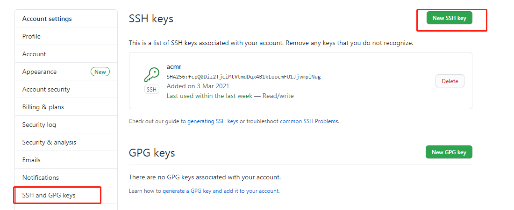
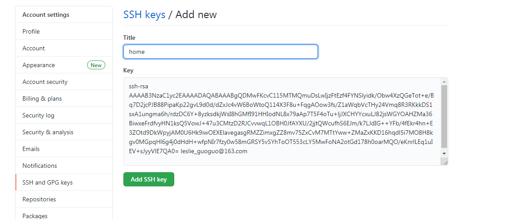
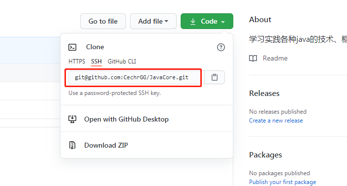

# git ssh key 配置
> 1. 查看配置
``` shell
git config --global --list
```
> 2. 如果没有则配置用户名，邮箱
``` shell
git config --global user.name "{用户名}"
git config --global user.email "{邮箱}"
```
> 3. 生成秘钥, 执行以下命令，步骤默认回车即可
``` shell
ssh-keygen -t rsa -C "{邮箱}"
#查看sshkey
cd ~/.ssh/
cat id_rsa.pub
```
> 默认写在id_rsa.pub文件中,复制其中的内容粘贴到github的sshkey中





> 4. git 配置即可使用ssh的方式了


