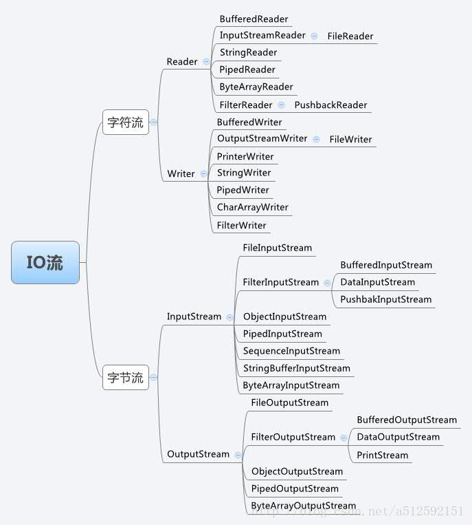

# Java IO 详解
> IO主要指输入输出流，流的概念即是任何有能力产出数据的数据源对象或者是有能力接受数据的接收端对象  
> JAVA IO采用装饰者模式，按功能划分Stream, 可以动态搭配这些Stream



> 字节流：每次读取(写出)一个字节，当传输的资源文件有中文时，可能出现乱码。     
> 字符流：每次读取(写出)两个字节，有中文时，使用该流就可以正确传输显示中文。

## 1 InputStream/OutputStream 字节输入/输出流
> 所有字节输入/输出流的父类，这里以FileInputStream/FileOutputStream为例简单看一下
```java
public class IOStreamTest {
    public static void main(String[] args) {
        FileInputStream fis = null;
        FileOutputStream fos = null;
        try {
            File file = new File("F:\\idea\\JavaCore\\javacore\\mark\\io.md");
            if(!file.exists()) {
                file.createNewFile();
            }
            File bakFile = new File("F:\\idea\\JavaCore\\javacore\\mark\\io_bak.md");
            if(!bakFile.exists()) {
                bakFile.createNewFile();
            }
            fis = new FileInputStream(file);
            fos = new FileOutputStream(bakFile);
            byte[] buffer = new byte[1024];
            int count;
            int total = 0;
            while ((count = fis.read(buffer)) != -1) { //一次读取buffer.length字节
                total += count;
                System.out.println("已读取" + total + "个字节");
                fos.write(buffer, 0, count);    //如果直接write(buffer),最后一次默认刷buffer.length
            }
//            fos.flush();  //FileOutputStream中并没有重写flush, 而OutputStream中的flush也啥都没做
        } catch (IOException e) {
            e.printStackTrace();
        } finally {
            try {   //关闭流还是很重要的，否则可能会产生问题
                if (fis != null) {
                    fis.close();
                }
                if (fos != null) {
                    fos.close();
                }
            } catch (IOException e) {
                e.printStackTrace();
            }
        }

    }
}
```

## 2 Reader/Writer 字符输入/输出流
> 以FileReader/FileWriter为例简单看一下
```java
public class RWStreamTest {
    public static void main(String[] args) {
        try {
            FileReader reader = new FileReader("F:\\idea\\JavaCore\\javacore\\mark\\io.md");
            FileWriter writer = new FileWriter("F:\\idea\\JavaCore\\javacore\\mark\\io_bak.md");
            char[] buffer = new char[1024];
            int count;
            while ((count = reader.read(buffer)) != -1) {
                writer.write(buffer, 0, count);
            }
            writer.flush();
            writer.close();
            reader.close();
        } catch (IOException e) {
            e.printStackTrace();
        }
    }
}
```

## Serializable 序列化
处理对象流的一种机制
* 序列化：把Java对象转换为可保持或传输的字节序列
* 反序列化：把Java对象的字节序列恢复为Java对象
> 作用：序列化传递和保存对象，保证对象的完整性和可传递性，反序列化重建对象，从而实现进程间或网络上的对象传输。
 
> 常见场景：
> * 对象信息持久化
> * 进程间传递对象
> * 网络传输对象
> * RMI传输对象

> 实现方式：实现Serializable或者Externalizable接口(继承Serializable)     
> Serializable接口没有任何方法，相当于只是一个标识        
> Externalizable接口有两个方法，readExternal()和writeExternal(),可实现对象输入输出流的自定义
> > 注意
> > * 关键字transient和static修复的属性不会被序列化,  
> > * transient关键字的可以通过重写readExternal和writeExternal来实现序列化,   
> > * static修饰的不是成员变量，只能通过手工方法去序列化
> > * 序列化类必须最好一个静态长整型 serialVersionUID用于标识版本，否则可能异常
> > * 序列化类的引用成员必须也是可序列化的
> > * 序列化读写一定要保证顺序一致

> 例如下面的例子
```java
public class EntityTest implements Serializable, Externalizable {
    private static final long serialVersionUID = 2056797420304837250L;
    private String serializable;                //普通成员，可序列化，但如果实现Externalizable的方法中没处理也不能序列化
    private transient String unSerializable;    //transient, 不可序列化
    private transient String stillSerializable; //虽然transient修饰，但如果实现Externalizable的方法中做处理也可序列化
    private static String neverSerializable;    //static 不是对象的成员变量，不能序列化，但可以手工添加序列化方法

    public static String getNeverSerializable() {
        return neverSerializable;
    }

    public static void setNeverSerializable(String neverSerializable) {
        EntityTest.neverSerializable = neverSerializable;
    }

    public String getStillSerializable() {
        return stillSerializable;
    }

    public void setStillSerializable(String stillSerializable) {
        this.stillSerializable = stillSerializable;
    }

    public String getSerializable() {
        return serializable;
    }

    public void setSerializable(String serializable) {
        this.serializable = serializable;
    }

    public String getUnSerializable() {
        return unSerializable;
    }

    public void setUnSerializable(String unSerializable) {
        this.unSerializable = unSerializable;
    }

    public void serializeStatic(ObjectOutputStream out) throws IOException {
        out.writeObject(neverSerializable);
    }

    public void deserializeStatic(ObjectInputStream in) throws IOException, ClassNotFoundException {
        neverSerializable = (String)in.readObject();
    }

    @Override
    public void writeExternal(ObjectOutput out) throws IOException {
        out.writeObject(serializable);
        out.writeObject(stillSerializable);
//        out.writeObject(neverSerializable);
    }

    @Override
    public void readExternal(ObjectInput in) throws IOException, ClassNotFoundException {
        serializable = (String)in.readObject();
        stillSerializable = (String)in.readObject();
//        neverSerializable = (String)in.readObject();
    }
}
public class SerializableTest {

    public static void main(String[] args) throws IOException, ClassNotFoundException {
        EntityTest test = new EntityTest();
        test.setSerializable("我是序列化属性");
        test.setUnSerializable("我就序列化不了？");
        test.setStillSerializable("看我还是序列化了");
        EntityTest.setNeverSerializable("难道我可以序列化？");
        ObjectOutputStream out = new ObjectOutputStream(new FileOutputStream(new File("D:\\serializable.txt")));
        out.writeObject(test);
//        test.serializeStatic(out);
        out.close();
        EntityTest.setNeverSerializable("想序列化我，没门儿");
        ObjectInputStream in = new ObjectInputStream(new FileInputStream(new File("D:\\serializable.txt")));
        EntityTest getTest = (EntityTest)in.readObject();
//        getTest.deserializeStatic(in);
        System.out.println(getTest.getSerializable());
        System.out.println(getTest.getUnSerializable());
        System.out.println(getTest.getStillSerializable());
        System.out.println(EntityTest.getNeverSerializable());
    }
}

```