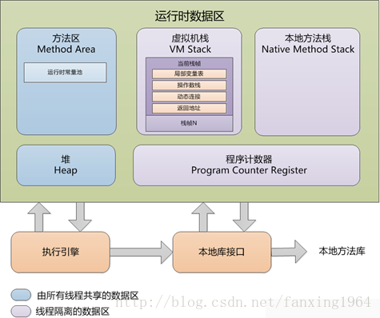
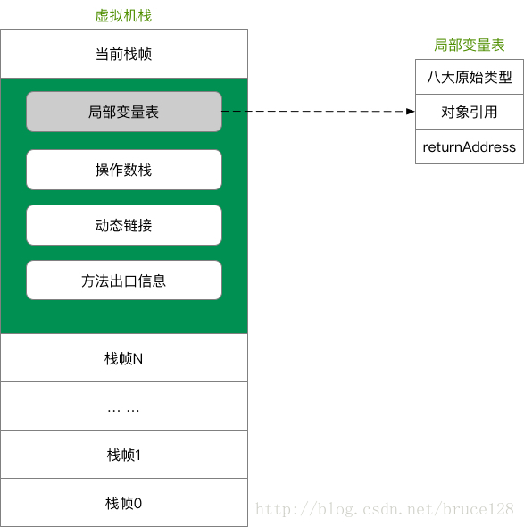

# JVM 详解
## 1 JVM概述
> JVM(Java Virtual Machine, Java虚拟机)，是一种用于计算设备的规范，通过仿真模拟各种计算机功能来实现。
> 是实现Java跨平台可移植特性的关键。Java编译程序只需生成在Java虚拟机上运行的目标代码（字节码）即可，
> 解释成具体操作系统平台机器指令则通通交给JVM处理，这样就使得Java能够“一次编译，到处运行”了。        
> Java 程序的具体执行过程如下图

## 2 JVM体系结构
    

>简要示意       

###2.1 类加载器
> - 负责加载class文件到运行时数据区，不管其是否可以运行
> - 种类：虚拟机自带的（包括Bootstrap、Extension、AppClassLoader)和用户自定义（继承抽象类ClassLoader）
> - 双亲委派机制(防止重复，保证安全)
>> 当一个类收到类加载请求，它首先不会尝试自己去加载这个类，而是先把这个请求委派给父类去完成，每一个层次类加载器都是如此，
>> 因此所有的类加载请求都是应该传到启动类加载器中的，只有当其父类加载器自己无法完成这个请求的时候（在他的加载路径下没有找到所需加载的Class）,子类加载器才会尝试自己去加载。
>> 
>> 采用双亲委派的一个好处就是比如加载位于rt.jar包中的类java.lang.Object，不管是哪个加载器加载这个类，最终都是会委托给顶层的启动类加载器进行加载，这样就保证了使用不同的类加载器最终
>> 得到的都是同一个Object对象。
> 
> - 沙箱安全机制
>> 通过双亲委派机制，类的加载永远都是从 启动类加载器开始，依次下放，保证你所写的代码，不会污染Java自带的源代码，所以出现了双亲委派机制，保证了沙箱安全
###2.2 运行时数据区

- 2.2.1 Program Counter Register(程序计数器,PC寄存器)
  > - 指向当前线程所执行的字节码行号      
  > - JVM进行多线程调度，当CPU暂停运行当前线程把时间片让给其他线程时，就需要PC寄存器记录当前执行的位置
  > 当其再次抢占CPU资源时便从纪录位置开始执行，因此它是线程私有的    
  > - 如果是native方法则为**NULL**
- 2.2.2 VM Stack(虚拟机栈)
  > - 线程私有的，生命周期与线程同步
  > - 每个Java方法在被调用的时候都会创建一个栈帧，并入栈；完成调用则出站，所有栈帧出栈后，线程也就完成了使命
  > - 栈帧
      
  > 1. 局部变量表：基本数据类型，对象引用（局部变量，不包含成员变量；调用的是存在堆中的对象；所需内存在编译期已经确定，运行时不会在更改）。
  > 2. 操作数栈：存储方法参数和运算操作后的结果。
  > 3. 动态链接：将符号引用转换为直接引用，比如调用接口，通过字面量链接到具体实现类。
  > 4. 方法出口：返回地址，return或者发生exception等。
- 2.2.3 Native Method Stack(本地方法栈)
  > 类似虚拟机栈，只是用于native方法。
- 2.2.4 Heap(堆)
  > - JVM中占用最大，管理最复杂的区域 
  > - 存放对象实例和数组，几乎所有对象实例都在此分配
  > - 被所有线程共享
  > - GC工作的主要区域
  > - 1.7后字符串常量池从永久代中剥离，放入堆中
###2.3 执行引擎