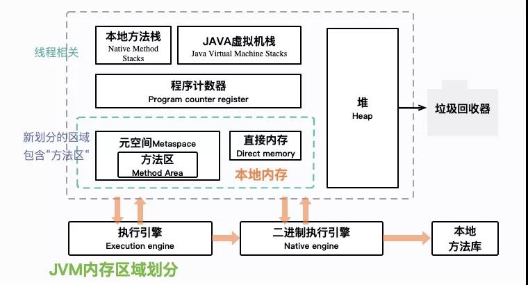
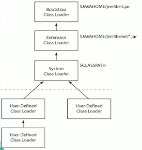

# JVM 详解
## 1 JVM概述
> JVM(Java Virtual Machine, Java虚拟机)，是一种用于计算设备的规范，通过仿真模拟各种计算机功能来实现。
> 是实现Java跨平台可移植特性的关键。Java编译程序只需生成在Java虚拟机上运行的目标代码（字节码）即可，
> 解释成具体操作系统平台机器指令则通通交给JVM处理，这样就使得Java能够“一次编译，导出运行”了。        
> Java 程序的具体执行过程如下图

## 2 JVM体系结构
    

>简要示意       

###2.1 类加载器
> - 负责加载class文件到运行时数据区，不管其是否可以运行
> - 种类：虚拟机自带的（包括Bootstrap、Extension、AppClassLoader)和用户自定义（继承抽象类ClassLoader）
> - 双亲委派机制(防止重复，保证安全)
>> 当一个类收到类加载请求，它首先不会尝试自己去加载这个类，而是先把这个请求委派给父类去完成，每一个层次类加载器都是如此，
>> 因此所有的类加载请求都是应该传到启动类加载器中的，只有当其父类加载器自己无法完成这个请求的时候（在他的加载路径下没有找到所需加载的Class）,子类加载器才会尝试自己去加载。
>> 
>> 采用双亲委派的一个好处就是比如加载位于rt.jar包中的类java.lang.Object，不管是哪个加载器加载这个类，最终都是会委托给顶层的启动类加载器进行加载，这样就保证了使用不同的类加载器最终
>> 得到的都是同一个Object对象。
> 
> - 沙箱安全机制
>> 通过双亲委派机制，类的加载永远都是从 启动类加载器开始，依次下放，保证你所写的代码，不会污染Java自带的源代码，所以出现了双亲委派机制，保证了沙箱安全
###2.2 运行时数据区

###2.3 执行引擎