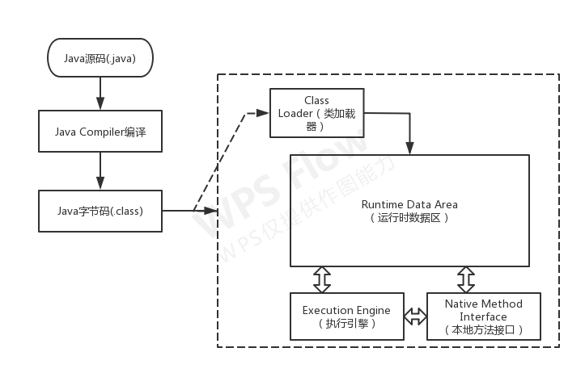
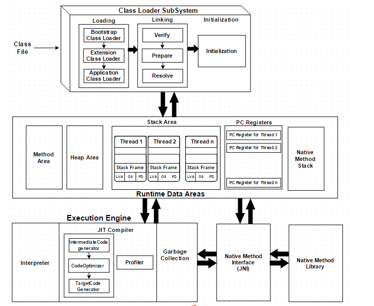
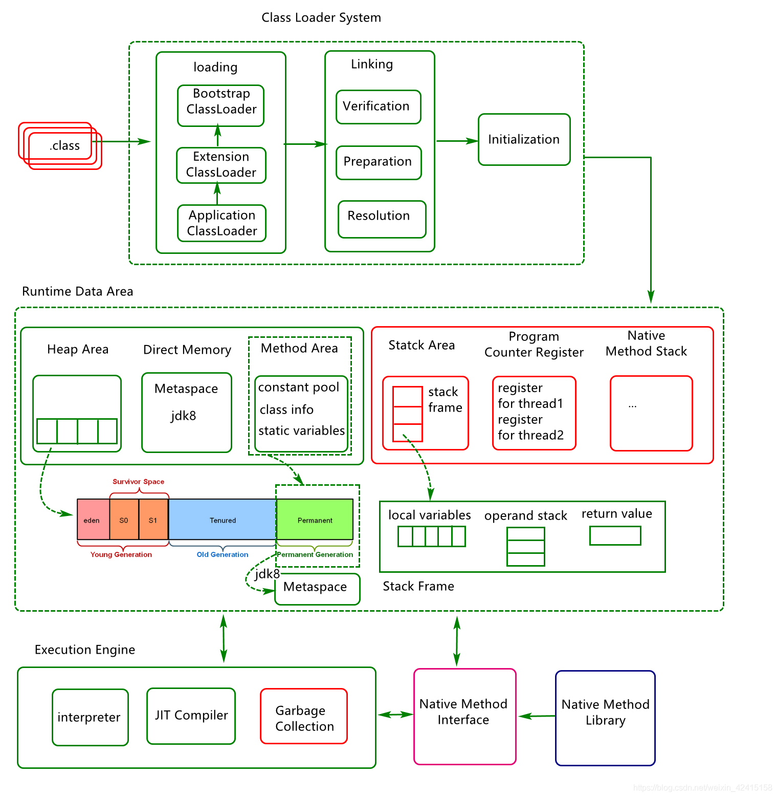
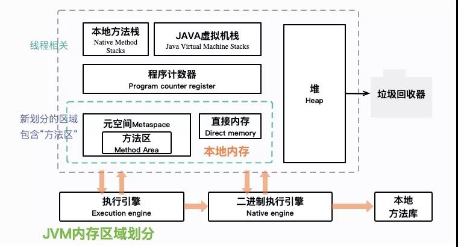
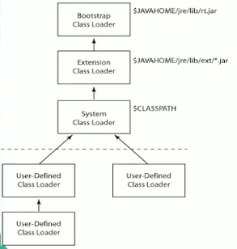
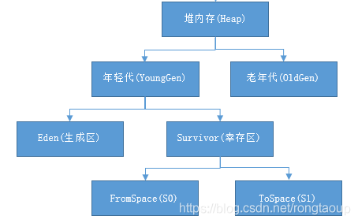
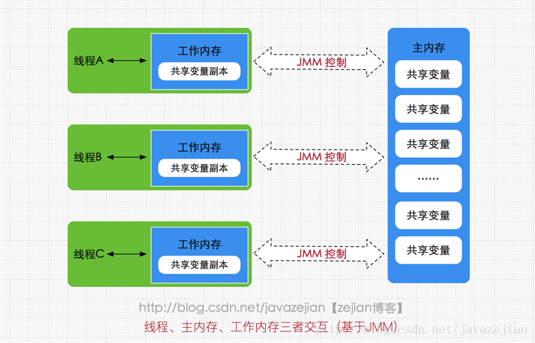

# JVM 详解
## 1 JVM概述
> JVM(Java Virtual Machine, Java虚拟机)，是一种用于计算设备的规范，通过仿真模拟各种计算机功能来实现。
> 是实现Java跨平台可移植特性的关键。Java编译程序只需生成在Java虚拟机上运行的目标代码（字节码）即可，
> 解释成具体操作系统平台机器指令则通通交给JVM处理，这样就使得Java能够“一次编译，到处运行”了。        
> Java 程序的具体执行过程如下图



## 2 JVM体系结构
    



>简要示意       



### 2.1 类加载器
> - 负责加载class文件到运行时数据区，不管其是否可以运行
> - 种类：虚拟机自带的（包括Bootstrap、Extension、AppClassLoader)和用户自定义（继承抽象类ClassLoader）
> - 双亲委派机制(防止重复，保证安全)
>> 当一个类收到类加载请求，它首先不会尝试自己去加载这个类，而是先把这个请求委派给父类去完成，每一个层次类加载器都是如此，
>> 因此所有的类加载请求都是应该传到启动类加载器中的，只有当其父类加载器自己无法完成这个请求的时候（在他的加载路径下没有找到所需加载的Class）,子类加载器才会尝试自己去加载。
>> 
>> 采用双亲委派的一个好处就是比如加载位于rt.jar包中的类java.lang.Object，不管是哪个加载器加载这个类，最终都是会委托给顶层的启动类加载器进行加载，这样就保证了使用不同的类加载器最终
>> 得到的都是同一个Object对象。
>        
> - 沙箱安全机制
>> 通过双亲委派机制，类的加载永远都是从 启动类加载器开始，依次下放，保证你所写的代码，不会污染Java自带的源代码，所以出现了双亲委派机制，保证了沙箱安全
### 2.2 运行时数据区
       

- 2.2.1 Program Counter Register(程序计数器,PC寄存器)
  > - 指向当前线程所执行的字节码行号      
  > - JVM进行多线程调度，当CPU暂停运行当前线程把时间片让给其他线程时，就需要PC寄存器记录当前执行的位置
  > 当其再次抢占CPU资源时便从纪录位置开始执行，因此它是线程私有的    
  > - 如果是native方法则为**undefined**
- 2.2.2 VM Stack(虚拟机栈)
  > - 线程私有的，生命周期与线程同步
  > - 每个Java方法在被调用的时候都会创建一个栈帧，并入栈；完成调用则出站，所有栈帧出栈后，线程也就完成了使命
  > - 栈帧
  
     
  
  > 1. 局部变量表：基本数据类型，对象引用（局部变量，不包含成员变量；调用的是存在堆中的对象；所需内存在编译期已经确定，运行时不会在更改）。
  > 2. 操作数栈：存储方法参数和运算操作后的结果。
  > 3. 动态链接：每个栈帧都包含一个指向运行时常量池中该栈帧所属方法的引用，持有这个引用是为了支持方法调用过程中的动态链接。   
  >   将符号引用转换为直接引用，比如调用接口，通过字面量链接到具体实现类。
  > 4. 方法出口：返回地址，return或者发生exception等。
- 2.2.3 Native Method Stack(本地方法栈)
  > 类似虚拟机栈，只是用于native方法。
- 2.2.4 Heap(堆)
  > - JVM中占用最大，管理最复杂的区域 
  > - 存放对象实例和数组，几乎所有对象实例都在此分配
  > - 被所有线程共享
  > - GC工作的主要区域
  > - 1.7后字符串常量池从永久代中剥离，放入堆中  
  > 下图是堆内存结构
         
  > 分为年轻代（Young Generation）和老年代（Old Generation）；  
  > 年轻代又分为伊甸园（Eden）和幸存区（Survivor区）；幸存区又分为From Survivor空间和 To Survivor空间。  
  > 年轻代存储“新生对象”，我们新创建的对象存储在年轻代中。当年轻内存占满后，会触发Minor GC，清理年轻代内存空间。   
  > 老年代存储长期存活的对象和大对象。年轻代中存储的对象，经过多次GC后仍然存活的对象会移动到老年代中进行存储。    
  > 老年代空间占满后，会触发Full GC。  
  > Full GC是清理整个堆空间，包括年轻代和老年代。如果Full GC之后，堆中仍然无法存储对象，就会抛出OutOfMemoryError异常。
- 2.2.5 Method Area(方法区)
  > - 所有线程共享
  > - 包括已加载的类信息、常量、静态变量及JIT(Just-In-Time Compiler，即时编译器)编译的代码
  > - 1.8 之后被MetaSpace(元数据空间)替代，MetaSpace不再使用jvm内存，而使用本地内存
### 2.3 执行引擎
    
  > 执行引擎的作用就是解析JVM字节码指令，得到执行的结果。执行引擎由各个厂家实现。  
  > SUN的hotspot是一种基于栈的执行引擎。而Android的Dalvik是基于寄存器的执行引擎。  
  > 执行引擎也就是执行一条条代码的一个流程，代码都包含在方法体中，执行引擎本质上就是执行一个个方法串起来的流程，  
  > 对应于操作系统的一个线程，每个java线程就是一个执行引擎的实例
## 3 JMM Java内存模型
       
  > JMM(Java Memory Model,Java 内存模型)，是一种抽象概念，描述了一组规则或规范，  
  > 通过这组规范定义了程序中各变量的访问方式，决定了一个线程对共享变脸的写入何时对另一个线程可见。  
  > JMM定义了线程和主内存之间的抽象关系：
  > - 每个线程都有一个私有的本地内存(local memory)，本地内存中存储了该线程可以读写共享变量的副本。
  > - 线程之间的共享变量存储在主内存(main memory)
## 4 GC(Garbage Collection,垃圾回收)
  > GC可以理解为追踪仍然使用的所有对象，并将其余对象标记为垃圾然后进行回收。
  > 主要包括以下几个方面
  > - GC对象引用判断策略
  > - GC收集算法
  > - GC收集器
## 4.1 GC判断策略
  1. Java 中的引用
     > - **强引用**：最普遍的，就是将一个对象赋给一个应用变量。
     > 如：String string = new String("string");
     > 只用引用变量存在，就永远不能被回收，也是造成OOM的主因。
     > - **软引用**：内存空间足够时不回收，内存不足则回收，用于实现内存敏感的高速缓存。
     ```java
        public class ReferenceTest {
            public static void main(String[] args) {
                //强引用
                Object object = new Object();
                //软引用，内存足够时不回收，不够时回收
        //        SoftReference<Object> ref = new SoftReference<>(object);
                //弱引用，不管内存是否足够都回收
        //        WeakReference<Object> ref = new WeakReference<>(object);
                //虚引用，几乎相当于没引用，主要用于跟踪GC状态
                ReferenceQueue<Object> queue = new ReferenceQueue<>();
                PhantomReference<Object> ref = new PhantomReference<>(object, queue);
                System.out.println(object);
                System.out.println(ref);
                System.out.println(ref.get());
                object = null;
                System.out.println(ref.get());
                System.gc();
                System.out.println(object);
                System.out.println(ref.get());
                System.out.println(ref);
                System.out.println(ref.isEnqueued());
                System.out.println(queue.poll());
            }
        }
     ```
     > - **弱引用**：不管内存空间是否足够，都会回收，可将上面的代码换成WeakReference对比
     > - **虚引用**: 不会决定对象的生命周期，一个对象持有虚引用，就跟没有引用查不多，不能通过它访问引用的对象。     
     需要配合引用队列使用，用于GC监听，跟踪垃圾回收过程。
     
  2. 引用计数算法
     > 给对象添加一个引用计数器，每当有其他变量引用它时，计数器就加1；引用失效时，计数器就减1；  
     > 任何计数器为0的对象都可以被当做垃圾收集。当一个对象被收集时，它引用的任何对象计数减1。   
     > - **优点**：实现简单，效率高
     > - **缺点**：无法检测循环引用，可能导致内存泄漏
  3. 可达性分析算法
     > 主流方法，基本思路就是通过一系列“GC Roots"的对象作为起点，从这些节点开始向下搜索， 
     > 到达叶子节点走过的路径称为引用链，当一个对象到GC Roots没有任何引用链时，则证明此对象不可达。   
     Java 中的GC Roots 包括：
     > - 虚拟机栈（准确的说是栈帧中的本地变量表）中引用的对象
     > - 方法区中类静态属性引用的对象
     > - 方法区中常量引用的对象
     > - 本地方法栈中引用的对象
### 4.2 GC收集算法                   
  > - **标记-清除算法（Mark-Sweep）**   
  > 判断哪些数据需要清除，并对其进行标记，然后清除被标记的数据   
  > *缺点*：会产生大量不连续的内存碎片，碎片太多可能导致以后要分配较大对象时，无法找到足够的连续内存而不得不提前触发GC
  > - **复制算法（Copying, 操作存活对象）**  
  > 将可用内存按容量分为大小相等的两块，每次只使用其中一块，当一块内存用完需要GC时，
  > 就将存活对象复制到另一块上面，然后将第一块内存全部清除。这样做不会有碎片问题，但浪费了空间，适用于存活率非常低的情况。
  > - **标记-整理算法（Mark-Compact, 操作清理对象）**   
  > 将废弃对象做上标记，然后将未标记对象移到一边，最后清空另一边区域即可。
  > 这样就不用浪费内存空间，也避免了碎片化问题，适用于存活率较高的情况。
  > - **分代收集算法（Generational Collection, HotSpot虚拟机GC采用这种）**  
  > 根据对象存活周期的不同，将内存划分为几块。参照2.2.2堆结构。    
  > 堆中的新生代采用复制算法，老年代采用标记-整理算法。  
  > 默认新生代：老年代=1：2 新生代Eden:Survivor0:Survivor1=8:1:1 
  >     1. 对象通常分配在Eden区，大对象（需要大量内存的Java对象，如长字符串或数组）直接进入老年代 
  >     2. 当Eden区满后，会触发Minor GC,回收新生代，非常频繁，回收速度也较快
  >     3. 当老年代满后，则触发Full GC, 经常会伴随至少一次Minor GC,但并非绝对，Full GC速度一般会比Minor GC慢10倍以上
### 4.3 HotSpot GC 收集器
     
*有连线的表示可搭配使用*
> - **Serial(串行)**  
> 1.3.1之前是新生代GC唯一选择 
> 针对新生代，采用复制算法，单线程串行（即，"stop the world"）,简单高效，但数据量大时则影响响应   
> "-XX:+UseSerialGC"
> - **ParNew**  
> Serial的多线程版本  
> Server模式下重要的收集器，因为除Serial外，它是唯一可与CMS配合的收集器    
> "-XX:+UseConcMarkSweepGC" 指定CMS后，年轻代默认使用ParNew    
> "-XX:+UseParNewGC"    
> "-XX:ParallelGCThreads=" 指定线程数量，默认与CPU相同
> - **Parallel Scavenge(吞吐量)**  
> 与吞吐量关系密切，目标是达到可控的吞吐量
> 与ParNew类似，新生代、复制算法、多线程    
> "-XX:MaxGCPauseMills=" 最大垃圾收集时间    
> "-XX:GCTimeRatio=" 垃圾收集时间占总时间比率，计算公式是1/(1+n),比如设置19是5%，默认是99即1%   
> "-XX:+UseAdaptiveSizePolicy" GC自适应调节策略，开启这个就不用手工指定一些细节参数，如-Xmn等， 
    JVM会根据运行情况动态调整已达到最合适的停顿时间和最大吞吐量
> - **Serial Old**  
> Serial的老年代版本，针对老年代
> 采用Mark-Compact算法，单线程，主要用于Client模式
> - **Parallel Old**
> Parallel Scavenge的老年代版本   
> 针对老年代，标记-整理算法，多线程，适用于高吞吐量和CPU敏感场景  
> "-XX:+UseParallelOldGC"
> - **CMS(Concurrent Mark Sweep GC)**   
> 并发标记清理，也称为并发低停顿(Concurrent Low Pause Collector)或低延迟收集器(Low Latency)   
> 针对老年代，标记-清理算法（会产生内存碎片），并发收集低停顿    
> 目标是获取最短停顿时间   
> 需要更大内存    
> "-XX:+UseConcMarkSweepGC" 
> 对CPU敏感，可能导致程序变慢，吞吐量变低，默认线程数是（CPU数+3)/4    
> 无法处理浮动垃圾，可能出现Concurrent Mode Failure失败
> 产生内存碎片
>   * "-XX:+UseCMSCompactAtFullGCCollection"    开启内存合并整理，但无法并发，停顿时间会变长，默认开启但不会进行因为下一个参数默认为0
>   * "-XX:+CMSFullGCsBeforeCompaction" 多少次Full GC之后来一次压缩整理，默认为0
> - **i-CMS(Incremental CMS)**  
> 增量并发收集器，为解决CMS吞吐量的问题，但效果不理想，1.6之后官方已不提倡使用
> - **G1(Garbage-First)**   
> JDK7-u4提供的商用收集器   
> 集各种收集器的优劣，统一管理堆内存，暂时不做深入研究
## 5 JVM 调优
### 5.1 常见参数
> 1. 堆
>   * -Xms4096m 初始堆大小4g
>   * -Xmx4096m 最大堆大小4g
>   * -Xmn1536m 年轻代大小1.5g，年轻代大小，官方推荐堆的3/8
>   * -XX:NewSize= 年轻代大小（1.3/1.4）
>   * -XX:MaxNewSize 年轻代最大值（1.3/1.4）
>   * -Xss512k 设置每个线程占用的堆栈大小，5.0后默认为1M
>   * -XX:NewRatio=3 年轻代与年老代比值，设置为3则为1：3，年轻代占1/4
>   * -XX:PermSize 永久代大小
>   * -XX:MaxPermSize 永久代最大值
>   * -XX:SurvivorRatio=4 Eden与Survivor的比值，设置为4，则为2：4，一个Survivor占1/6
>   * -XX:MaxTenuringThreshold=0 垃圾最大年龄，如果设置为0则年轻代不经过Survivor直接进入老年代,设置较大值则使对象在年轻代存活更久
> 2. 内存溢出
>   * -XX:+HeapDumpOnOutOfMemoryErr 内存溢出时生成dump文件
>   * -XX:HeapDumpPath=${目录} 生成dump文件的路径，也可指定文件名
> 3. 垃圾回收
>   * 收集器配置参照4.3
>   * -XX:+PrintGC 打印GC
>   * -XX:+PrintGCDetails   打印GC细节
>   * -XX:+PrintGCTimeStamps 打印GC时间戳
>   * -XX:+PrintHeapAtGC 打印GC前后堆栈信息  
>   * -Xloggc:${文件名} 与上面配合打印到文件
### 5.2 调优目标
> 1. 何时需要调优
>   * heap内存持续上涨达到设置的最大值，甚至出现OOM
>   * Full GC次数频繁
>   * GC停顿时间过长（超过1s）
>   * 大量占用本地内存空间
>   * 吞吐量与响应性能不高或下降
> 2. 调优原则
>   * 多数Java应用不需要在服务器上进行JVM优化
>   * 多数导致GC问题的Java应用，不是因为参数设置问题，而是代码本身问题
>   * 上线之前，先考虑将机器的JVM参数设置到最优
>   * 减少创建对象的数量
>   * 减少使用全局变量或大对象
>   * JVM优化是到最后不得已才采用的手段
>   * 实际情况大多是分析GC情况优化代码而非优化JVM参数
> 3. 调优目标
>   * GC低停顿
>   * GC低频率
>   * 低内存占用
>   * 高吞吐量
>   * 不同应用，因地制宜
### 5.3 调优步骤
>   * 分析GC日志及Dump文件，或借助其他工具（如GCViwer和MAT等），
      判断是否需要优化，确定瓶颈问题点
>   * 确定调优目标
>   * 确定调优参数
>   * 调优一台服务器，对比调优前后的差异
>   * 不断分析调整，直到参数值合适
>   * 配置合适参数并跟踪观察

  