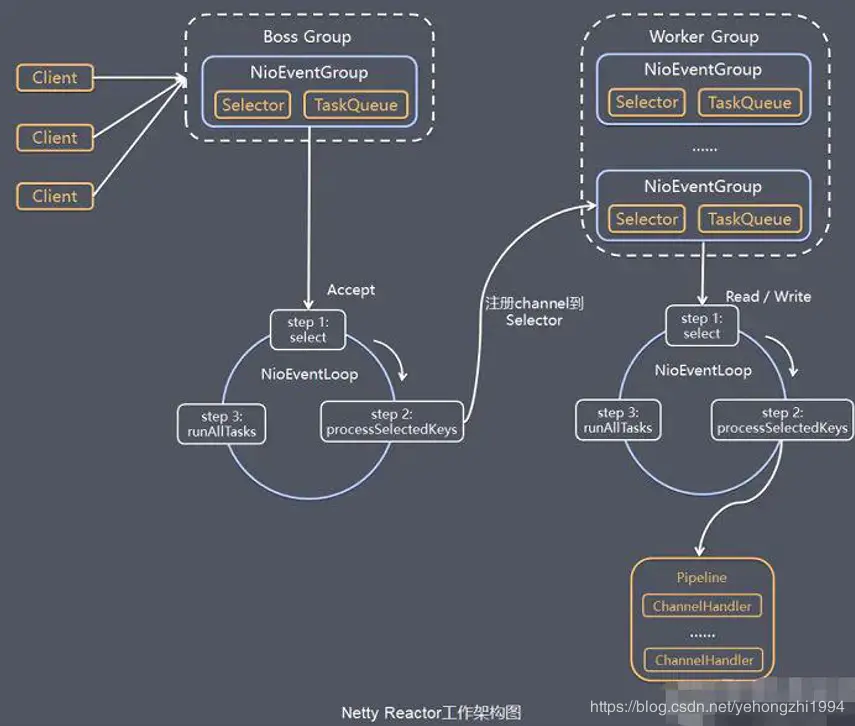

#Netty 详解
## 1 概述
> Netty是 一个异步事件驱动的网络应用程序框架，用于快速开发可维护的高性能协议服务器和客户端。
> * API使用简单，学习成本低。      
> * 功能强大，内置了多种解码编码器，支持多种协议。     
> * 性能高，对比其他主流的NIO框架，Netty的性能最优。        
> * 社区活跃，发现BUG会及时修复，迭代版本周期短，不断加入新的功能。       
> * Dubbo、Elasticsearch都采用了Netty，质量得到验证。        

1、BIO、NIO和AIO模型的区别

2、同步与异步、阻塞与非阻塞的区别

3、select、poll、epoll的机制及其区别

4、Netty底层操作与Java NIO操作对应关系如何

5、Netty的线程模型是怎样的，与Redis线程模型有区别吗

6、说说Reactor响应式编程是怎么回事

7、Netty的粘包/拆包是怎么处理的，有哪些实现

8、Netty的protobuf编解码机制是怎样的

9、Netty如何实现断线自动重连

10、Netty如何支持单机百万连接

11、说下Netty零拷贝的原理

12、说下Netty如何实现长连接心跳保活机制

13、Netty的内存池是怎么实现的

14、Netty是如何解决NIO底层epoll空轮询导致CPU 100%的Bug

15、Netty高并发高性能体现在哪些方面

16、基于Netty如何设计微信钉钉后端高并发IM架构