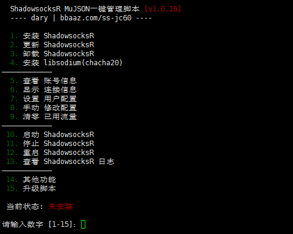
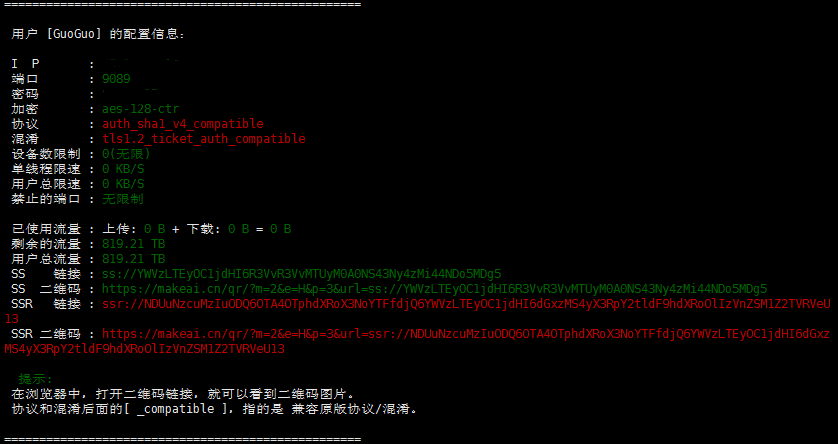

# 科学上网
## 1 购买VPS
[vultr(5刀/月)](https://www.vultr.com/)   
[hostwinds(4.99刀/月)](https://www.hostwinds.com/)    
[搬瓦工](https://www.bbaaz.com/thread-55-1-1.html)

## 2 安装SSR
> * 执行下面命令，安装ssr
```shell
wget -N --no-check-certificate https://makeai.cn/bash/ssrmu.sh && chmod +x ssrmu.sh && bash ssrmu.sh
```

> * 输入1开始安装，设置用户名，密码，端口号，其他均默认或者'y'即可，安装成功如下



## 3 安装ssr客户端
> * [客户端](https://www.bbaaz.com/thread-20-1-1.html)     
> * 当前目录下

## 4 安装bbr加速
> 执行下面命令，然后按任意键安装，直到提示重启
```shell
wget -N --no-check-certificate https://makeai.cn/centosbbr/bbr.sh && chmod +x bbr.sh && bash bbr.sh
```
> 重启即可YouTube高清不卡
> > ***如果安装完bbr之后连不上，则可能是防火墙的问题    
> > centos7 关闭防火墙 systemctl stop firewalld.service  
> > 永久关闭 systemctl disable firewalld.service***